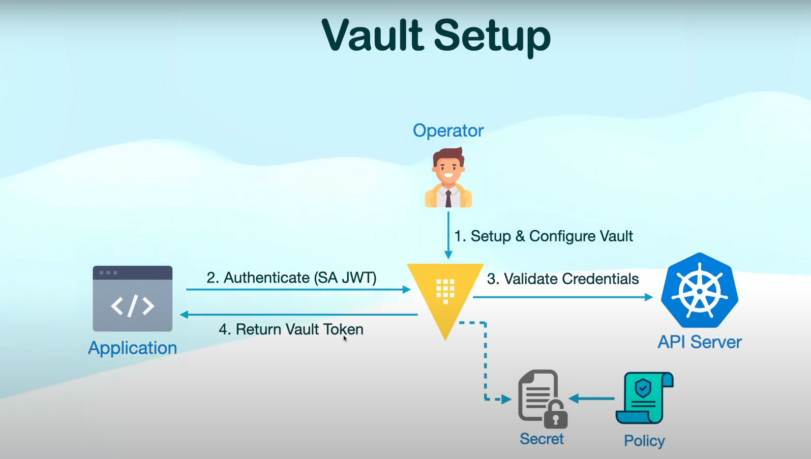
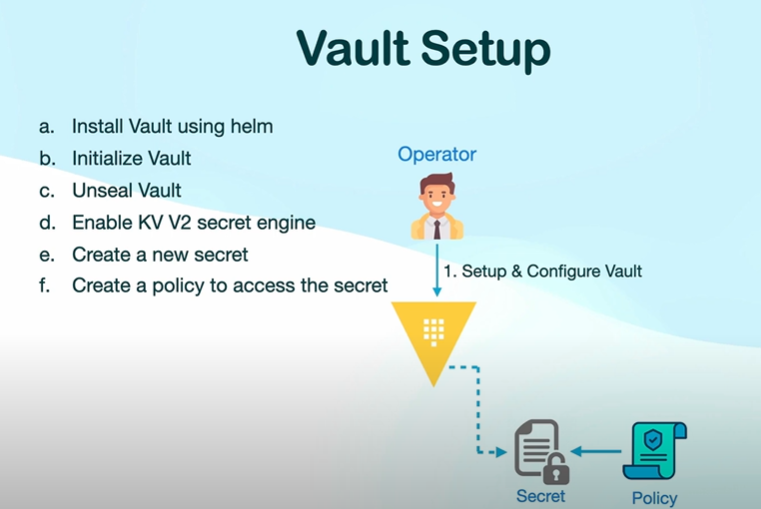
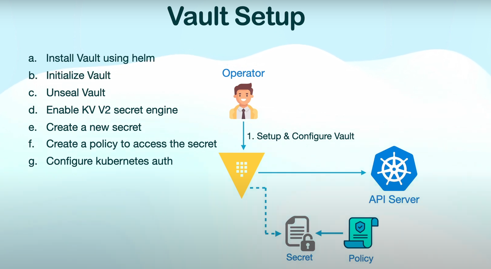
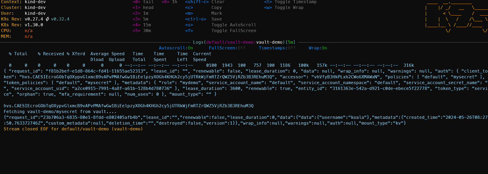

## HELM WORKFLOW



vault setup



Enable k8s auth



## Install K9s

```
Mac OS
    brew install k9s
    k9s

Debian
    sudo snap install k9s
```


## Create Kubernetes Cluster

Run the script create_cluster.sh in scripts folder

```
./create_cluster.sh
```

## Using Helm to install the Hashicorp vault

```
 helm repo add hashicorp https://helm.releases.hashicorp.com
 helm install vault hashicorp/vault -n vault --create-namespace
```


## Init the Vault
``` 
When the hashicorp vault install at the first time it is in seal state we need to unseal follow these steps

# exec into the pod first

## initialize vault to get root token and unseal keys
vault operator init

## use 3 keys to unseal vault, run this command 3 times
vault operator unseal

## login to vault using root token
vault login <root-token>
```

## Enable kv secrets engine and add secret
```
    vault auth list

    vault auth enable kv-v2

    vault kv put kv-v2/vault-demo/mydemo name=koala

    vault kv get kv-v2/vault-demo/mydemo

    vault policy list

    #create the policy name my demo to access the path kv-v2/data/vault-demo/mydemo
    
    vault policy write mydemo - << EOF
    path "kv-v2/data/vault-demo/mydemo" {
    capabilities = ["read"]
    }
    EOF
```

## Configure backend and role

```
## exec into vault server

vault auth enable kubernetes

vault write auth/kubernetes/config \
    kubernetes_host=https://$KUBERNETES_SERVICE_HOST:$KUBERNETES_SERVICE_PORT


#this a role use to get the token and check with the policy to retrive the value
#we can see this role is my-demo and apply the policy mydemo

vault write auth/kubernetes/role/my-demo \
    bound_service_account_names=default \
    bound_service_account_namespaces=default \
    policies=default,mydemo \
    ttl=1h
```

## Pod 
```
apiVersion: v1
kind: Pod
metadata:
  name: vault-demo
spec:
  restartPolicy: "OnFailure"
  containers:
    - name: vault-demo
      image: badouralix/curl-jq
      command: ["sh", "-c"]
      resources: {}
      args:
      - |
        VAULT_ADDR="http://vault-internal.vault:8200"
        SA_TOKEN=$(cat /var/run/secrets/kubernetes.io/serviceaccount/token)
        VAULT_RESPONSE=$(curl -X POST -H "X-Vault-Request: true" -d '{"jwt": "'"$SA_TOKEN"'", "role": "mydemo"}' \
          $VAULT_ADDR/v1/auth/kubernetes/login | jq .)

        echo $VAULT_RESPONSE
        echo ""

        VAULT_TOKEN=$(echo $VAULT_RESPONSE | jq -r '.auth.client_token')
        echo $VAULT_TOKEN

        echo "Fetching vault-demo/mysecret from vault...."
        VAULT_SECRET=$(curl -s -H "X-Vault-Token: $VAULT_TOKEN" $VAULT_ADDR/v1/kv-v2/data/vault-demo/mydemo)
        echo $VAULT_SECRET

        exit 0;
```

The result will be 



